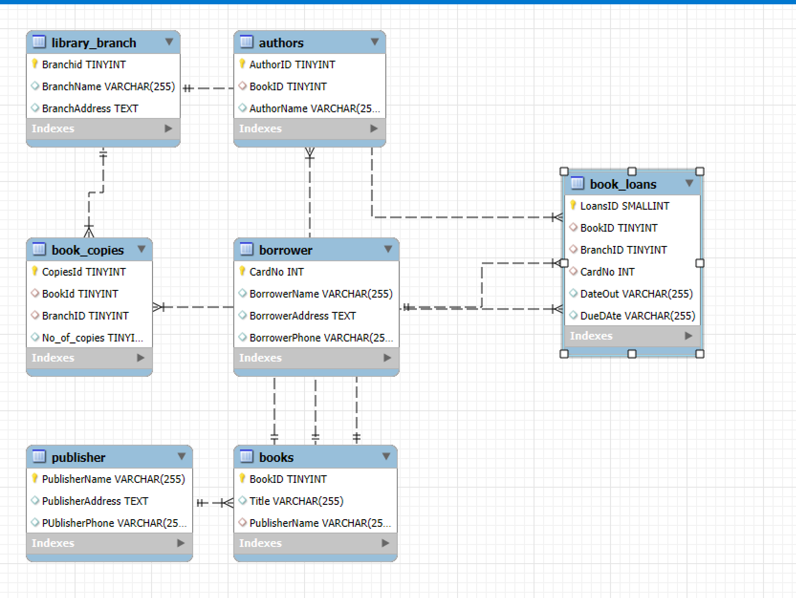

# 📚 Library Management SQL Analysis

## 🧠 Objective
To design and analyze a relational database for a library system using SQL. This project involves understanding borrowing trends, book availability, and branch-level activity through SQL queries.

---

## 🛠️ Tools & Technologies
- SQL (MySQL/PostgreSQL)
- DBMS Concepts (Joins, Aggregations, Subqueries)
- ER Modeling
- DBeaver / MySQL Workbench (for query execution)

---

## 🗃️ Database Schema

The database is designed with the following tables:

- `Author`
- `Books`
- `Publisher`
- `Library_Branch`
- `Book_Copies`
- `Borrower`
- `Book_Loans`

### 🧩 ER Diagram


---

## 🔍 Key Analysis Performed

### 1️⃣ Top 5 Borrowed Books
```sql
SELECT B.Title, COUNT(*) AS Times_Borrowed
FROM Book_Loans BL
JOIN Book_Copies BC ON BL.BookID = BC.BookID
JOIN Books B ON B.BookID = BC.BookID
GROUP BY B.Title
ORDER BY Times_Borrowed DESC
LIMIT 5;
```
### 2 Most active borrowers
```sql
SELECT BW.Name, COUNT(*) AS Total_Loans
FROM Borrower BW
JOIN Book_Loans BL ON BW.CardNo = BL.CardNo
GROUP BY BW.Name
ORDER BY Total_Loans DESC;
```

### 3 Book copies in each brance
```sql
SELECT LB.Branch_Name, SUM(BC.No_Of_Copies) AS Total_Copies
FROM Library_Branch LB
JOIN Book_Copies BC ON LB.Branch_ID = BC.Branch_ID
GROUP BY LB.Branch_Name;
```

### 4 Books by each publiser
```sql
SELECT P.Pub_Name, COUNT(*) AS Books_Published
FROM Publisher P
JOIN Books B ON P.Publisher_Name = B.Publisher_Name
GROUP BY P.Pub_Name;
```

## 💡 Key Insights
- A small set of books are borrowed very frequently, suggesting they are student favorites.

- Certain borrowers are extremely active—potential library power users.

- Some branches maintain higher stock of book copies, reflecting their demand.

- Publishers like Pearson and McGraw-Hill dominate academic publishing in the dataset.

##  📌 Learning Outcomes
- Stronger understanding of relational databases and normalization

- Practical hands-on experience with joins, subqueries, and groupings

- Insightful patterns from library usage data


---

## 🔗 Connect with Me
Check out more projects on my [GitHub](https://github.com/Abhiram4u) or reach out via [LinkedIn](https://www.linkedin.com/in/abhiram06o9).

